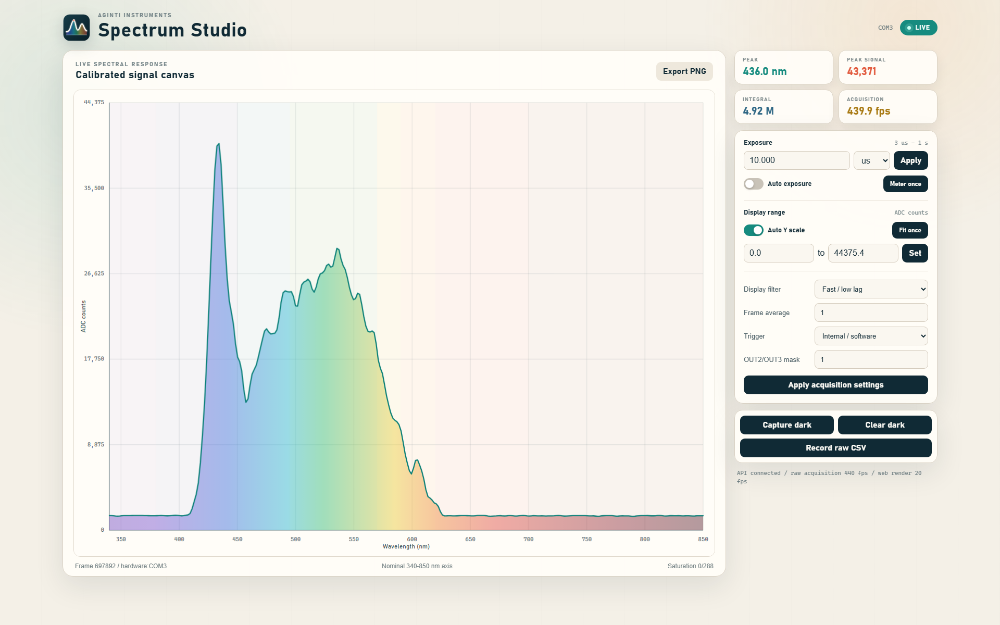

# AgInTi Spectrum Studio

[English](README.md) · [العربية](i18n/README.ar.md) · [Español](i18n/README.es.md) · [Français](i18n/README.fr.md) · [日本語](i18n/README.ja.md) · [한국어](i18n/README.ko.md) · [Tiếng Việt](i18n/README.vi.md) · [中文 (简体)](i18n/README.zh-Hans.md) · [中文（繁體）](i18n/README.zh-Hant.md) · [Deutsch](i18n/README.de.md) · [Русский](i18n/README.ru.md)

[](https://lazying.art)

<p align="center">
  <strong>High-rate C12880MA acquisition, adaptive exposure, and agent-ready spectral instrumentation.</strong>
</p>

<p align="center">
  <a href="https://github.com/lachlanchen/AgInTi-Spectrometer"></a>
  <a href="https://lazying.art"></a>
  
</p>


An independent acquisition and visualization application for the Hamamatsu C12880MA and its supplied USB controller. It reproduces the working vendor transport while keeping acquisition independent from GUI refresh, validating every 288-pixel frame, recording raw spectra, and exposing diagnostics for later system integration.

## Verified hardware protocol

The vendor GUI was traced from process startup while displaying a live spectrum. The controller identifies itself by returning `c12880` at 256,000 baud, then uses 1,500,000-baud, 8-N-1 acquisition. A 10 us request is `FF AA 01 00 00 00 32 0D 0A`; each response is exactly 590 bytes: a 12-byte reserved header, 576 bytes for 288 little-endian 16-bit pixels, and a 2-byte trailer. On this workstation the controller is STM32 VCP `0483:5740` on `COM3`; the CH343 on `COM5` is unrelated.

The application also reproduces the vendor startup correction-memory request (`FF 09`), exposure updates, software/external trigger modes, and OUT2/OUT3 mask.

## Run

```powershell
cd C:\Users\Administrator\Projects\spectral
uv sync --extra vendor
uv run spectrum-studio
```

Probe without starting the GUI:

```powershell
uv run spectrum-studio --probe --port COM3 --exposure-ms 0.01
```

Open only the bundled reference dataset:

```powershell
uv run spectrum-studio --demo
```

## GUI, CLI, and API control

The GUI starts a thread-safe control API at `http://127.0.0.1:8766`. Bind with
`--api-host 0.0.0.0` only when a trusted LAN agent must reach it. GUI, CLI, and
HTTP commands share the same validated control actions.

```powershell
uv run spectrum-studio ctl status
uv run spectrum-studio ctl exposure 250 us
uv run spectrum-studio ctl exposure 10 ms
uv run spectrum-studio ctl exposure-auto on
uv run spectrum-studio ctl exposure-meter
uv run spectrum-studio ctl y-auto on
uv run spectrum-studio ctl y-fit
uv run spectrum-studio ctl smoothing smooth
```

Direct HTTP clients can use `GET /api/v1/status` and POST JSON to
`/api/v1/exposure`, `/api/v1/exposure/auto`, `/api/v1/exposure/meter`,
`/api/v1/y-scale/auto`, `/api/v1/y-scale/fit`, `/api/v1/y-scale/limits`, and
`/api/v1/smoothing`.

The same live instrument is available as a responsive web application at
`http://127.0.0.1:8766/`. It renders the latest spectrum independently of raw
capture and exposes exposure, scaling, smoothing, trigger, averaging, dark
reference, and recording controls. The desktop and web applications share the
same API state, so a change in either interface appears in the other.

## Live Web Workbench



This capture shows the current wavelength-anchored under-curve color mapping
and approximately 440 validated hardware frames per second. Web rendering
remains capped independently, so visualization does not throttle acquisition.

## Features

- Active `c12880` identity probing, so selection does not depend on a guessed VID/PID or COM number.
- Vendor-compatible identity, initialization, exposure, output-mask, and trigger transactions.
- Exact 590-byte frame validation and 288-pixel decoding.
- Background acquisition with a 30 Hz GUI refresh, so plotting does not determine capture rate.
- A 3 us to 1 s integration range with continuous auto exposure and one-shot metering.
- Continuous or one-shot Y-range fitting, plus editable fixed display limits.
- Wavelength-colored under-curve shading and display-only low-lag smoothing.
- Local HTTP/JSON control and a CLI client for agents and external applications.
- A responsive Canvas web instrument and shared spectral-wave application icon.
- Internal/software and external/TTL trigger modes.
- Integration-time control, frame averaging, dark subtraction, CSV recording, and PNG export.
- Nominal 340-850 nm mapping with support for per-device wavelength coefficients.
- Explicit raw-byte, identity, correction-memory, saturation, and frame-rate diagnostics.

## Calibration limitation

Hamamatsu supplies wavelength-conversion coefficients on each sensor's individual test result sheet. Until those coefficients are entered, the app uses a clearly marked nominal linear 340-850 nm axis. This is suitable for connection testing and qualitative visualization, not calibrated peak metrology.

See [references/protocol.md](references/protocol.md) for the recovered protocol,
[references/vendor-recovery.md](references/vendor-recovery.md) for the local
source-recovery workflow, and
[references/wavelength-rendering-and-fps-limits.md](references/wavelength-rendering-and-fps-limits.md)
for the rendering and throughput analysis.

## Support

[](https://chat.lazying.art/donate)
[](https://paypal.me/RongzhouChen)
[](https://buy.stripe.com/aFadR8gIaflgfQV6T4fw400)
